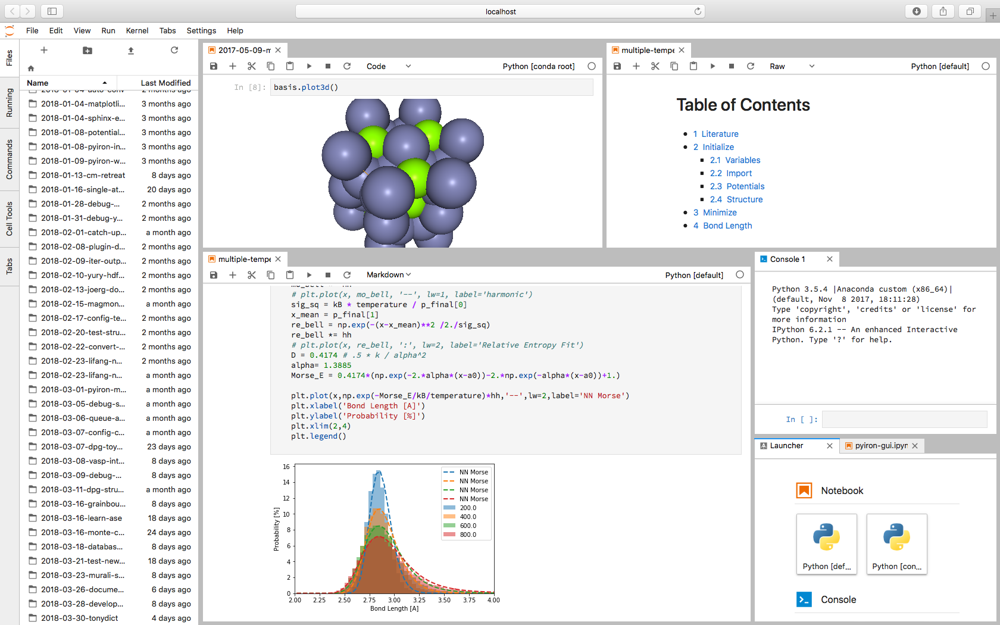

# About

## Introduction

pyiron is an integrated development environment for implementing, testing, and running simulations in computational 
materials science. It combines several tools in a common platform:
 
* Atomic structure objects – compatible to the [Atomic Simulation Environment (ASE)](https://wiki.fysik.dtu.dk/ase/).
* Atomistic simulation codes – like [LAMMPS](http://lammps.sandia.gov) and [VASP](https://www.vasp.at).
* Feedback Loops – to construct dynamic simulation life cycles.
* Hierarchical data management – interfacing with storage resources like SQL and 
  [HDF5](https://support.hdfgroup.org/HDF5/).
* Integrated visualization – based on [NGLview](https://github.com/arose/nglview).
* Interactive simulation protocols - based on [Jupyter notebooks](http://jupyter.org).
* Object-oriented job management – for scaling complex simulation protocols from single jobs to high-throughput 
  simulations.

pyiron (called pyron) is developed in the [Computational Materials Design department](https://www.mpie.de/CM) of 
[Joerg Neugebauer](https://www.mpie.de/person/43010/2763386) at the 
[Max Planck Institut für Eisenforschung (Max Planck Institute for iron research)](https://www.mpie.de/2281/en). While 
its original focus was to provide a framework to develop and run complex simulation protocols as needed for ab initio 
thermodynamics it quickly evolved into a versatile tool to manage a wide variety of simulation tasks. In 2016 the 
[Interdisciplinary Centre for Advanced Materials Simulation (ICAMS)](http://www.icams.de) joined the development of the
framework with a specific focus on high throughput applications. In 2018 pyiron was released as open-source project.

## Getting Help
Technical issues and bugs should be reported on [Github](https://github.com/pyiron) all other questions can be asked on
[stackoverflow using the tag pyiron](https://stackoverflow.com/questions/tagged/pyiron). 
